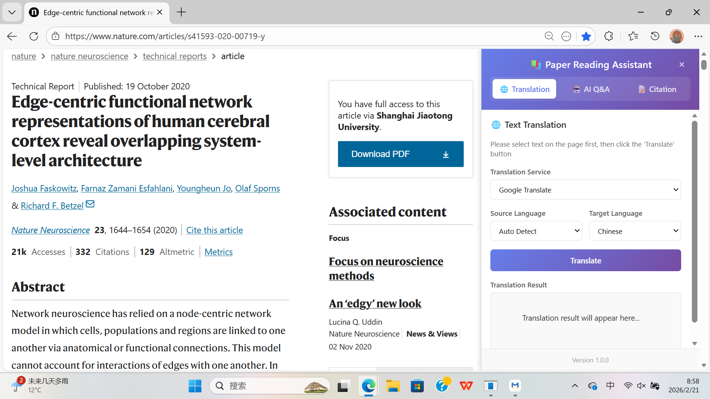
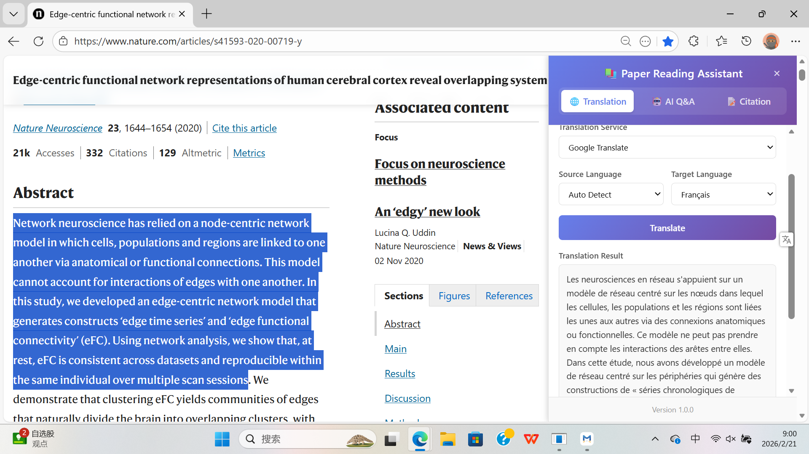
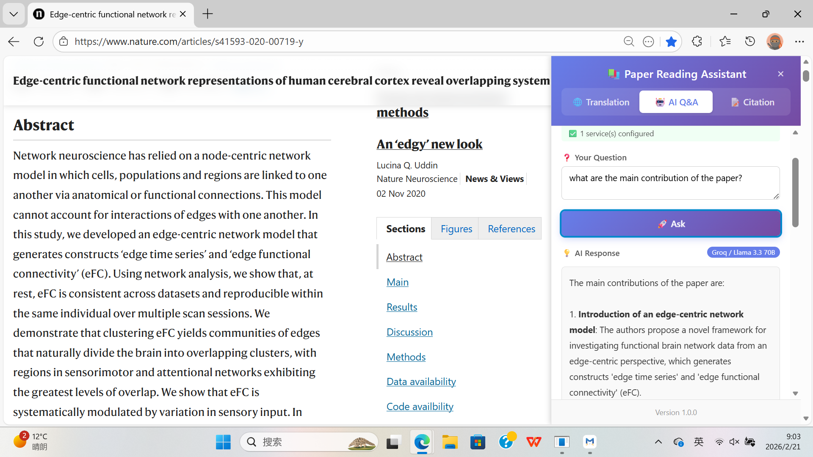
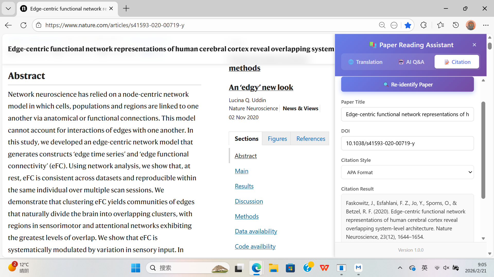

# Paper Reading Assistant

[](LICENSE)
[](https://microsoftedge.microsoft.com/addons/detail/paper-reading-assistant/caopenjadgljahlniclfddhnhopaoneo)

**Language / 语言**: [English](README.md) | [简体中文](README_zh-CN.md)

**Changelog / 更新日志**: [English](CHANGES.md) | [简体中文](CHANGES_zh-CN.md)

---

An Edge browser extension designed for academic researchers, integrating three core features: **Text Translation**, **AI Q&A**, and **Citation Generation**, to facilitate efficient reading and understanding of academic papers.

Supports Chinese and English (following browser default language).

**Install from Edge Store**: [Click here to install](https://microsoftedge.microsoft.com/addons/detail/paper-reading-assistant/caopenjadgljahlniclfddhnhopaoneo)

If you like this project, please give it a ⭐ star, thanks!

**Contact**: augustus_wu@126.com



---

## 📑 Table of Contents

- [Core Features](#-core-features)
- [Usage](#-usage)
- [Installation Guide](#-installation-guide)
- [Project Structure](#-project-structure)
- [Internationalization](#-internationalization)
- [License](#-license)

---

## 🌟 Core Features

### 🌐 Text Translation

- Multi-language translation with automatic source language detection
- Supports multiple translation services: Baidu, Tencent, Bing, Google, LibreTranslate
- Automatically copy translation results to clipboard



### 🤖 AI Q&A

- Intelligent Q&A based on paper content for in-depth understanding
- Support for multiple AI providers (Groq, Hugging Face)
- Multiple model options for different scenarios
- Conversation history saved for future reference



### 📝 Citation Generation

- Support for 7 mainstream citation formats: APA, MLA, Chicago, Harvard, IEEE, Vancouver, BibTeX
- One-click generation of standard citations with quick copy to clipboard
- Based on Crossref API for automatic DOI detection from web pages



---

## 📖 Usage

### Basic Operations

1. Click the extension icon in the browser toolbar to open the sidebar
2. Switch between feature modules using the top tabs
3. Click the theme toggle button (🌙/☀️) in the top-left corner to switch between light mode and dark mode
4. Drag the left edge of the sidebar to adjust its width (280px - 600px)

### Text Translation

1. Select the "Translation" tab
2. Select the text to translate on the web page
3. Choose translation service and target language
4. Click the translate button to get the result

### AI Q&A

1. Select the "AI Q&A" tab
2. Configure API Key on first use (click the settings button ⚙️)
3. Enter your question to get intelligent answers based on paper content
4. Multi-turn dialogue supported with automatic history saving

### Citation Generation

1. Select the "Citation" tab
2. Choose the target citation format
3. Click generate and copy to clipboard with one click

### AI Service Configuration

#### Groq (VPN required in China)

1. Visit [Groq Console](https://console.groq.com/keys)
2. Register an account and create an API Key
3. Select Groq provider in extension settings and enter the Key

**Supported Models:**

| Model | Description |
|-------|-------------|
| Llama 3.3 70B | High performance model |
| Llama 3.1 8B | Lightweight and fast |
| Qwen3 32B | Tongyi Qianwen |
| GPT-OSS 20B | OpenAI open source |

#### Hugging Face (VPN required in China)

1. Visit [Hugging Face Tokens](https://huggingface.co/settings/tokens)
2. Create an Access Token
3. Select Hugging Face provider in extension settings and enter the Token

**Supported Models:**

| Model | Description |
|-------|-------------|
| Qwen 2.5 72B | Alibaba's large model |
| Llama 3.3 70B | Meta open source |
| DeepSeek V3 | DeepSeek large model |

---

## 📥 Installation Guide

### Prerequisites

- Edge browser (or Chromium-based browser)
- Groq or Hugging Face API Key required for AI services

### Installation Steps

1. Download and extract the project source code:

   ```bash
   git clone https://github.com/JAWu600/Paper-Reading-Assistant.git
   ```

2. Open Edge browser and navigate to `edge://extensions/`
3. Enable **"Developer mode"** in the top right corner
4. Click **"Load unpacked"** and select the project folder
5. After installation, click the extension icon to start using

---

## 📁 Project Structure

```
paper-reading-assistant/
├── manifest.json              # Extension configuration file
├── background.js              # Background service script
├── content.js                 # Content script
├── content.css                # Content styles
├── _locales/                  # Internationalization files
│   ├── zh_CN/                 # Simplified Chinese
│   │   └── messages.json      # Chinese language pack
│   └── en/                    # English
│       └── messages.json      # English language pack
├── sidebar/                   # Sidebar module
│   ├── SidebarManager.js      # Sidebar manager
│   ├── TabManager.js          # Tab manager
│   ├── FeatureRegistry.js     # Feature registry
│   ├── sidebar.css            # Sidebar styles
│   └── features/              # Feature modules
│       ├── TranslationFeature.js  # Text translation
│       ├── QAFeature.js           # AI Q&A
│       └── CitationFeature.js     # Citation generation
├── icons/                     # Icon files
│   └── icon.png               # Extension icon
├── figures/                   # Documentation screenshots
│   ├── cover.png              # Interface cover
│   ├── text-translation.png   # Translation feature screenshot
│   ├── AI-QA.png              # AI Q&A screenshot
│   └── citation.png           # Citation feature screenshot
├── README.md                  # Documentation (English)
├── README_zh-CN.md            # Documentation (Chinese)
├── CHANGES.md                 # Changelog (English)
└── CHANGES_zh-CN.md           # Changelog (Chinese)
```

---

## 🌍 Internationalization

This extension supports both Chinese and English languages using the Chrome extension standard i18n internationalization scheme:

- **Default language**: Simplified Chinese (`zh_CN`)
- **Supported languages**:
  - Simplified Chinese (`zh_CN`) - Default
  - English (`en`)
- **Language files location**: `_locales/` directory

The extension automatically switches the interface language based on browser language settings.

---

## 📄 License

This project is licensed under the Apache-2.0 License - see the [LICENSE](LICENSE) file for details.

---

## 🤝 Contributing

Contributions are welcome! Please feel free to submit a Pull Request.

---

## 📮 Contact

If you have any questions or suggestions, feel free to contact me at: augustus_wu@126.com
