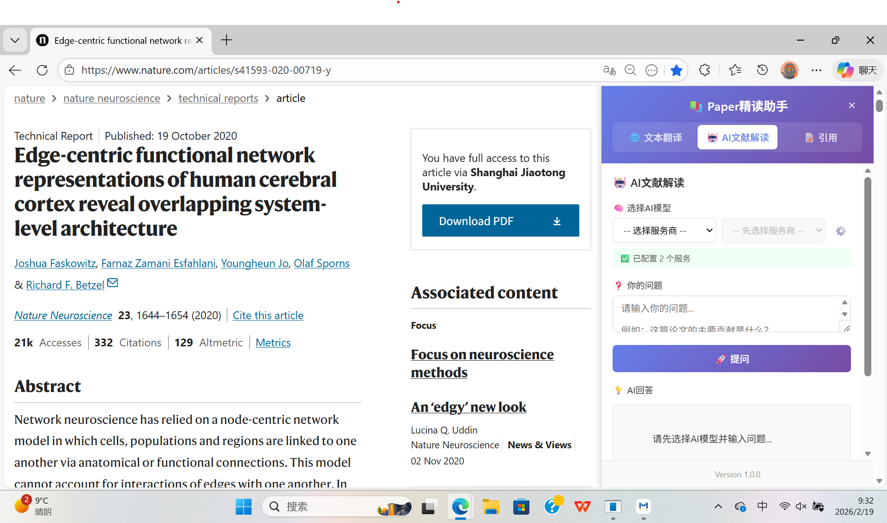
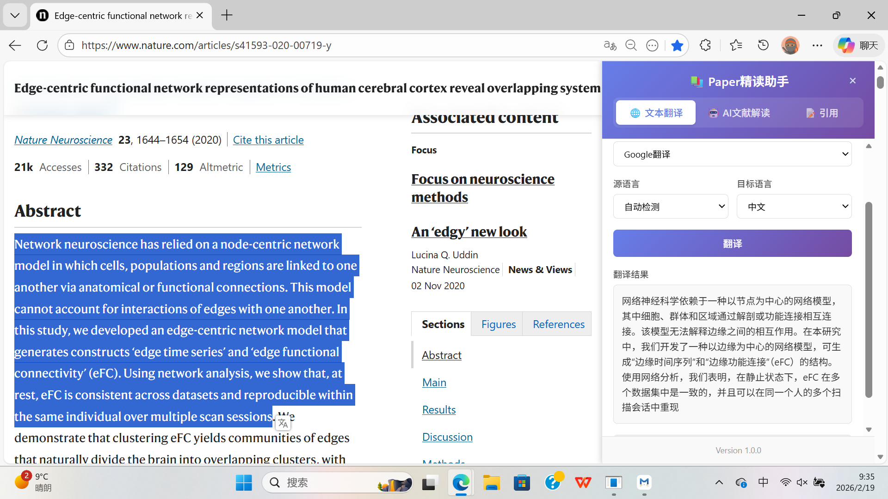
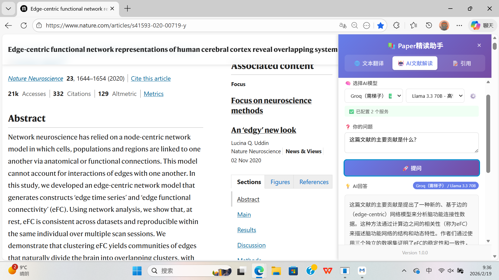
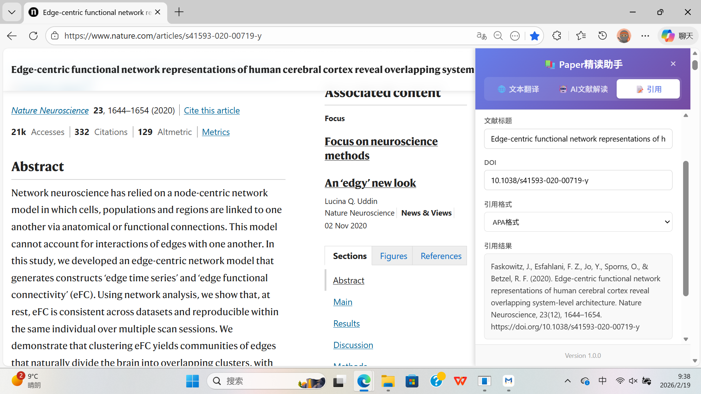

# 科研助读

[](LICENSE)
[](https://microsoftedge.microsoft.com/addons/detail/paper-reading-assistant/caopenjadgljahlniclfddhnhopaoneo)

**语言 / Language**: [简体中文](README_zh-CN.md) | [English](README.md)

**更新日志 / Changelog**: [简体中文](CHANGES_zh-CN.md) | [English](CHANGES.md)

---

一款专为科研人员打造的 Edge 浏览器扩展，集成**文本翻译**、**AI文献解读**、**引用生成**三大核心功能，助力高效阅读与理解学术论文。

支持中文、英文（跟随浏览器默认语言）。

**Edge 商店一键安装**: [点击这里安装](https://microsoftedge.microsoft.com/addons/detail/paper-reading-assistant/caopenjadgljahlniclfddhnhopaoneo)

如果喜欢，请给项目点个 ⭐ Star，谢谢！

**联系方式**: augustus_wu@126.com



---

## 📑 目录

- [核心功能](#-核心功能)
- [使用方法](#-使用方法)
- [安装指南](#-安装指南)
- [项目结构](#-项目结构)
- [国际化支持](#-国际化支持)
- [开源协议](#-开源协议)

---

## 🌟 核心功能

### 🌐 文本翻译

- 支持多语言互译，自动检测源语言
- 支持多种翻译服务：百度翻译、腾讯翻译、必应翻译、Google翻译、LibreTranslate
- 翻译结果可一键复制到剪贴板



### 🤖 AI文献解读

- 基于论文内容智能问答，深入理解文献
- 支持多种AI服务商（Groq、Hugging Face）
- 多模型选择，满足不同场景需求
- 对话历史保存，便于后续查阅



### 📝 引用生成

- 支持7种主流引用格式：APA、MLA、Chicago、Harvard、IEEE、Vancouver、BibTeX
- 一键生成标准引用，快速复制到剪贴板
- 基于Crossref API，自动识别页面DOI



---

## 📖 使用方法

### 基本操作

1. 点击浏览器工具栏中的扩展图标，打开侧边栏
2. 通过顶部标签切换功能模块
3. 点击左上角的主题切换按钮（🌙/☀️）可在浅色模式和深色模式之间切换
4. 可拖动侧边栏左侧边沿调整宽度（280px - 600px）

### 文本翻译

1. 选择「翻译」标签
2. 在网页上选中待翻译的文本
3. 选择翻译服务和目标语言
4. 点击翻译按钮获取结果

### AI文献解读

1. 选择「AI解读」标签
2. 首次使用需配置 API Key（点击设置按钮 ⚙️）
3. 输入问题，获取基于论文内容的智能回答
4. 支持多轮对话，历史记录自动保存

### 引用生成

1. 选择「引用」标签
2. 选择目标引用格式
3. 点击生成，一键复制到剪贴板

### AI服务配置说明

#### Groq（国内需翻墙）

1. 访问 [Groq Console](https://console.groq.com/keys)
2. 注册账号并创建 API Key
3. 在扩展设置中选择 Groq 服务商并填入 Key

**支持模型：**

| 模型 | 说明 |
|------|------|
| Llama 3.3 70B | 高性能模型 |
| Llama 3.1 8B | 轻量快速 |
| Qwen3 32B | 通义千问 |
| GPT-OSS 20B | OpenAI开源 |

#### Hugging Face（国内需翻墙）

1. 访问 [Hugging Face Tokens](https://huggingface.co/settings/tokens)
2. 创建 Access Token
3. 在扩展设置中选择 Hugging Face 服务商并填入 Token

**支持模型：**

| 模型 | 说明 |
|------|------|
| Qwen 2.5 72B | 阿里大模型 |
| Llama 3.3 70B | Meta开源 |
| DeepSeek V3 | DeepSeek大模型 |

---

## 📥 安装指南

### 前置要求

- Edge 浏览器（或 Chromium 内核浏览器）
- AI服务需配置 Groq 或 Hugging Face API Key

### 安装步骤

1. 下载本项目源码并解压：

   ```bash
   git clone https://github.com/JAWu600/Paper-Reading-Assistant.git
   ```

2. 打开 Edge 浏览器，访问 `edge://extensions/`
3. 开启右上角「开发人员模式」
4. 点击「加载解压缩的扩展」，选择项目文件夹
5. 安装完成后，点击扩展图标即可使用

---

## 📁 项目结构

```
paper-reading-assistant/
├── manifest.json              # 扩展配置文件
├── background.js              # 后台服务脚本
├── content.js                 # 内容脚本
├── content.css                # 内容样式
├── _locales/                  # 国际化语言文件
│   ├── zh_CN/                 # 简体中文
│   │   └── messages.json      # 中文语言包
│   └── en/                    # 英文
│       └── messages.json      # 英文语言包
├── sidebar/                   # 侧边栏模块
│   ├── SidebarManager.js      # 侧边栏管理器
│   ├── TabManager.js          # 标签管理器
│   ├── FeatureRegistry.js     # 功能注册表
│   ├── sidebar.css            # 侧边栏样式
│   └── features/              # 功能模块
│       ├── TranslationFeature.js  # 文本翻译
│       ├── QAFeature.js           # AI文献解读
│       └── CitationFeature.js     # 引用生成
├── icons/                     # 图标文件
│   └── icon.png               # 扩展图标
├── figures/                   # 文档截图
│   ├── cover.png              # 界面封面
│   ├── text-translation.png   # 翻译功能截图
│   ├── AI-QA.png              # AI问答截图
│   └── citation.png           # 引用功能截图
├── README.md                  # 说明文档（英文）
├── README_zh-CN.md            # 说明文档（中文）
├── CHANGES.md                 # 更新日志（英文）
└── CHANGES_zh-CN.md           # 更新日志（中文）
```

---

## 🌍 国际化支持

本扩展支持中文和英文两种语言，采用 Chrome 扩展标准的 i18n 国际化方案：

- **默认语言**：简体中文 (`zh_CN`)
- **支持语言**：
  - 简体中文 (`zh_CN`) - 默认
  - English (`en`)
- **语言文件位置**：`_locales/` 目录

扩展会根据浏览器语言设置自动切换界面语言。

---

## 📄 开源协议

本项目基于 Apache-2.0 协议开源，详见 [LICENSE](LICENSE) 文件。

---

## 🤝 参与贡献

欢迎提交 Issue 和 Pull Request！

---

## 📮 联系方式

如有问题或建议，欢迎联系：augustus_wu@126.com
